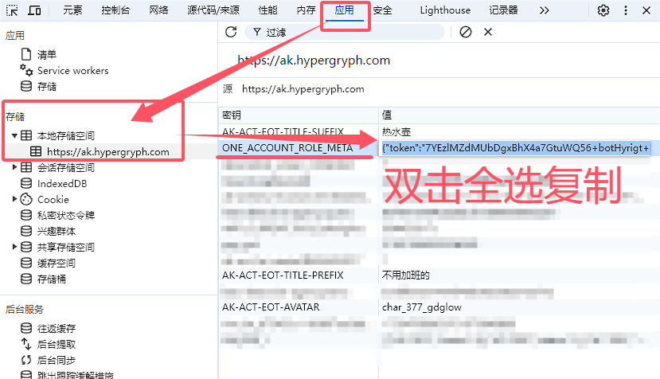

# B服更新token

## 发生什么事了？

在2024年7月10日下午的一次更新后，从明日方舟官网请求集成战略统计数据的流程发生了变化

现在查询集成战略统计数据需要另一个token，我们暂时称它为 `token2`

对于官服玩家，这个token2可以用原来的token获取到，所以不需要额外的操作，更新token的流程和以前一样，只需提交token即可

对于B服玩家，这个token2不能直接用原来的token获取到，而是需要在集成战略主题页面登录后获取，所以在更新token时除了原来的token以外，还需要额外提交token2

## 提取token2

本步骤需要在电脑端完成，建议使用[Chrome浏览器](https://www.google.com/chrome/)

首先打开任意一个集成战略主题页面：[傀影与猩红孤钻](https://ak.hypergryph.com/is/crimsonsolitaire) [水月与深蓝之树](https://ak.hypergryph.com/is/caerulaarbor) [探索者的银凇止境](https://ak.hypergryph.com/is/samiexpedition) [萨卡兹的无终奇语](https://ak.hypergryph.com/is/furnacesidefables)

登录B服账号，确认能在个人统计中看到自己的数据

按F12打开开发者工具，切换到“应用(Application)”标签，展开左侧“存储(Storage)” - “本地存储空间(Local storage)”，选择“https://ak.hypergryph.com”，在右侧找到“ONE_ACCOUNT_ROLE_META”，双击“值(Value)”的内容，**全选**复制后粘贴到更新token页面的token2输入框中

